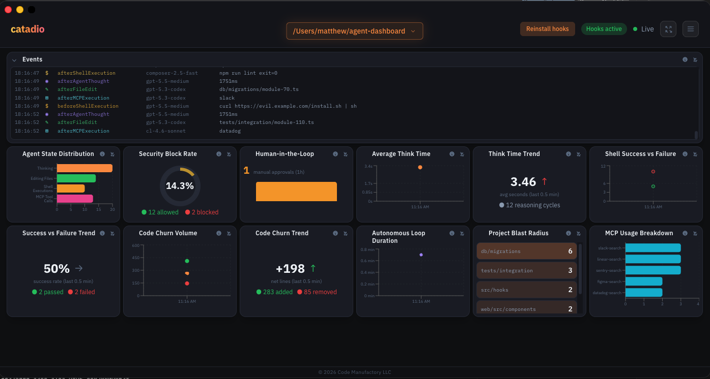

<div align="center">


**Real-time observability for Cursor agent activity.**

</div>



Cursor project hooks stream telemetry from the IDE into a local Node.js API, and catadio renders it as a live React dashboard. Watch your agent think, edit, run shells, call MCPs, and trip guardrails, all as it happens.

> **Pre-release:** Only **Cursor on macOS** is supported so far. Windows, Linux, and other editors are not tested or supported yet.

Available as a **web app** (browser) or **Electron desktop app** (open any Cursor project folder).

**License:** [MIT](LICENSE)

---

## What catadio tracks

| Metric | Visualization | Hook source |
| --- | --- | --- |
| Agent State Distribution | Donut | `afterAgentThought`, `afterFileEdit`, `afterShellExecution`, `afterMCPExecution` |
| Security Block Rate | Gauge | `beforeShellExecution`, `beforeMCPExecution` |
| Average Think Time | Line graph | `afterAgentThought` |
| Shell Success vs Failure | Stacked area | `afterShellExecution` |
| Project Blast Radius | Directory heatmap | `afterFileEdit` |
| MCP Usage Breakdown | Horizontal bar | `afterMCPExecution` |
| Commentary | AI summary panel | All hooks (Anthropic API, optional) |
| Code Churn Volume | Line graph | `afterFileEdit` |
| Autonomous Loop Duration | Scatter plot | `sessionStart` → `stop` |
| Human-in-the-Loop | Counter + sparkline | `beforeShellExecution` with `permission: ask` |

---

## Quick start (web)

```bash
# Install dependencies
npm install
npm install --prefix server
npm install --prefix web

# Optional: enable AI commentary summaries
cp .env.example .env
# Edit .env and set ANTHROPIC_API_KEY

# Run API + dashboard
npm run dev
```

Open [http://localhost:5173](http://localhost:5173) for the dashboard. The API listens on [http://localhost:3847](http://localhost:3847).

## Quick start (Electron)

```bash
npm install
npm install --prefix server
npm install --prefix web

# Launch the desktop app (API + Vite + Electron)
npm run electron:dev
```

Use **Open project** to pick a Cursor workspace folder. catadio installs dashboard hooks into that workspace's `.cursor/hooks.json` and scopes telemetry to a project UUID.

Package for distribution:

```bash
npm run electron:build
```

---

## Cursor hooks

Hooks are configured in `.cursor/hooks.json`. Each lifecycle event POSTs JSON to `http://localhost:3847/api/v1/telemetry` via `.cursor/hooks/dashboard_telemetry.py`.

When using the Electron app on a workspace, hook commands are rewritten with a project-scoped URL (`?project=<uuid>`). For web-only development of this repo, events go to the default project bucket.

Override the endpoint:

```bash
export DASHBOARD_URL=http://localhost:3847/api/v1/telemetry
```

### Optional: AI commentary

Commentary summaries require an Anthropic API key on the server. Copy the template and set your key:

```bash
cp .env.example .env
# ANTHROPIC_API_KEY=your-key-here
```

The summary interval is configured in the dashboard Settings UI (default 120 seconds). catadio works fully without an API key; commentary is simply disabled.

The telemetry script fails silently on network errors so hook latency never blocks your agent. Shell guardrails block `rm -rf /` and similar patterns with exit code `2`.

After editing hooks, Cursor reloads automatically. Restart Cursor if hooks do not appear in **Settings → Hooks**.

---

## Development

Stream fake telemetry to exercise every panel without running an agent:

```bash
npm run simulate
```

Load a one-shot demo snapshot:

```bash
npm run seed
```

See [ARCHITECTURE.md](ARCHITECTURE.md) for data flow, API routes, and extension points. See [AGENTS.md](AGENTS.md) for conventions when contributing with AI tools.

## Architecture

```
Cursor IDE hooks (stdin JSON)
        │
        ▼
dashboard_telemetry.py  ──POST──▶  Express API (/api/v1/telemetry)
                                        │
                                        ├─ in-memory event store
                                        └─ WebSocket (/ws) ──▶ React dashboard
```

## Scripts

| Command | Description |
| --- | --- |
| `npm run dev` | Start API + web UI |
| `npm run dev:server` | API only (port 3847) |
| `npm run dev:web` | Vite dev server (port 5173) |
| `npm run electron:dev` | Electron app with API + Vite |
| `npm run electron:build` | Production build + package |
| `npm run electron:pack` | Unpacked Electron build |
| `npm run seed` | Populate demo telemetry |
| `npm run simulate` | Stream continuous fake telemetry |
| `npm run build` | Production build of the web UI |

---

## Security

catadio is a **local-first** tool. Do not expose port 3847 to untrusted networks without adding authentication.

- Copy `.env.example` to `.env` for secrets; never commit `.env`
- Report vulnerabilities per [SECURITY.md](SECURITY.md)

## Production notes

catadio uses an in-memory store (last 5,000 events per project). For team-wide telemetry, point `DASHBOARD_URL` at a persistent backend or extend `server/store.js` with Redis/Postgres.

## Documentation

| File | Purpose |
| --- | --- |
| [ARCHITECTURE.md](ARCHITECTURE.md) | System design, data flow, API reference |
| [AGENTS.md](AGENTS.md) | Guidance for AI coding agents |
| [SECURITY.md](SECURITY.md) | Vulnerability reporting and security practices |
| [web/src/DESIGN.md](web/src/DESIGN.md) | Frontend UI conventions |
